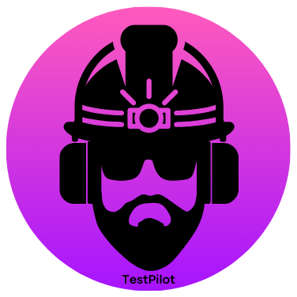

# **Testpilot** 🚀  
*Effortlessly generate test cases for Solidity smart contracts in VS Code.*  

Testpilot automates test case creation using OpenAI's API, saving you time and boosting productivity. No more manual test writing—let Testpilot handle it!  

---

## **Features** ✨  
- 🔥 **Generate test cases in seconds** with just a few clicks.  
- 🛠️ Supports popular testing tools like **Mocha with Chai**, **Jest**, **Truffle**, and **Ganache**.  
- 📂 Automatically creates **organized test folders and files** based on the active Solidity file.  
- 💬 Provides **custom messages** to guide you through different scenarios.  

---

## **Getting Started** 🏁  

1. Install the extension from the VS Code Marketplace.  
2. Run `npm i openai` to set up the required dependency.  
3. Use the **Command Palette** to run the commands (see below).  

---

## **Commands** 📜  

| **Command**                | **Description**                                                                                   |  
|----------------------------|---------------------------------------------------------------------------------------------------|  
| **Generate Tests**         | Prompts for GitHub token and base URL to generate test cases. Saves credentials for future use.   |  
| **Update API Key & Base URL** | Updates the saved API key and base URL if needed.                                                |  
| **Delete API Key & Base URL** | Removes your saved credentials.                                                                 |  

---

## **How to Use** 🛠️  

1. **Generate Tests**:  
   - Open the Command Palette (`Ctrl+Shift+P` or `Cmd+Shift+P`).  
   - Select `Generate Tests`.  
   - Provide your GitHub token and base URL (get free one [here](https://github.com/marketplace/models/azure-openai/gpt-4o/playground/code)).  
   - Choose your desired testing tool, and Testpilot will do the rest!  

2. **Update/Delete Credentials**:  
   - Use the respective commands from the Command Palette to manage your credentials.  

---

## **Dependencies** 🧩  
- **OpenAI API**: Install via `npm i openai`.  

---

## **Screenshots** 🖼️  

*(Add a few screenshots or GIFs showing how the extension works.)*  
<!-- 

  

 -->
---

## **Future Updates** 🌟  
- Improved AI-generated test quality.  
- Support for additional testing frameworks.  

---

## **Need Help?** 🤔  

Feel free to reach out or report issues on the [GitHub repository](#).  

---

## **About the Developer** 👨‍💻  
This extension was created by **Rohan**, a passionate fullstack developer specializing in frontend and blockchain technologies. Feel free to connect or share your feedback!

---  
Developed with ❤️ by [Rohan](https://github.com/Rohan749).  
(X handle)[https://x.com/heyrohan7]
